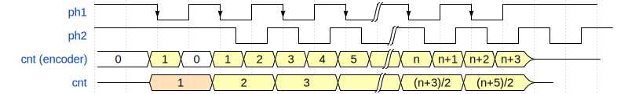

---
tags:
  - tiny-SMD-counter
  - 嵌入式
  - 正交编码器
---

# 关于计数与编码器的分析

## 漏计

8mm编带上每隔4mm会有一个1.5mm直径的孔洞。  
在计数器a0.1版本，两个光电管间距5mm，这导致第一个孔洞的计数被忽略。  
这是否会影响计数呢？我们借助[Wave Drom](https://wavedrom.com/editor.html)工具绘制了波形图：



<details>
<summary>源代码</summary>

```json
{
    "signal": [
        { "name": "ph1", "wave": "hN..|N.h", "period":2},
        { "name": "ph2", "wave": "h..n.|n..", "period":2,"phase":1.5},
        { "name": "cnt (encoder)", "wave":"2...3.2.3.3.3.3.3.3|3.3.3.3.z....", 
            "period":0.5, "phase":0.4, "data":["0","1","0","1","2","3","4","5","","n","n+1","n+2","n+3"]},
        { "name":"cnt", "wave":"z.4.3.3.3|3.3.z", "data":["1", "2", "3", "", "(n+3)/2", "(n+5)/2"],
            "phase":0.4}
    ]
}
```

</details>

如`cnt(encoder)`波形所示，ph1的第一个周期内，ph2一直处于高电平，所以ph1第一个下降沿的计数被第一个上升沿抵消，编码器计数漏计了。之后纸带抵达第二个光电对管，从此才开始正常计数。

然而这对于元件计数真的有影响吗？我们知道，ph1每经过一整个周期，元件计数才加一。所以我们可以直观地在图中看到，编码器计数`cnt(encoder)`变化两次，元件计数`cnt`才变化一次。

除了第一个元件，`cnt`和`cnt(encoder)`有着十分明显的关系（如图所示的`(n+3)/2`）。所以我们只需要对第一个元件在软件上做特殊的处理，之后的计数并不受影响。

## 回抽

真的这么简单吗？理想中，计数器在编带完全被回抽时，计数应该减回0。我们考虑用户试探性地插入编带，使得ph1获得一个下降沿，然后立即回抽编带，使得ph1获得一个上升沿。
这和正常计数的第一个周期的波形别无二致。软件就会误以为这是正常计数，从而回抽之后计数没有减少，而是停留在1。

那么这样，我们直接跳过1，从0直接跳到2呢？


<details>
<summary>源代码</summary>

```json
{
    "signal": [
        { "name": "ph1", "wave": "hN..|N.h", "period":2},
        { "name": "ph2", "wave": "h..n.|n..", "period":2,"phase":1.5},
        { "name": "cnt (encoder)", "wave":"2...3.2.3.3.3.3.3.3.|.3.3.3.z....", 
            "period":0.5, "phase":0.4, "data":["0","1","0","1","2","3","4","5","","n","n+1","n+2","n+3"]},
        { "name":"cnt", "wave":"z..3.3.3.3|3.3.z", "data":["0", "2", "3","", "(n+2)/2", "(n+4)/2"],
            "phase":0.4}
    ]
}
```

</details>

甚至不需要额外的特殊处理，真好啊。


