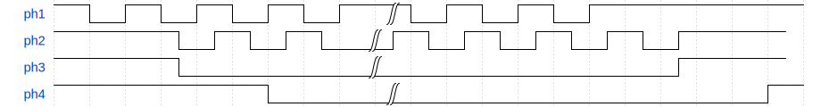
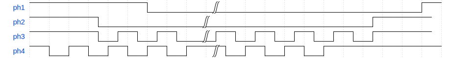
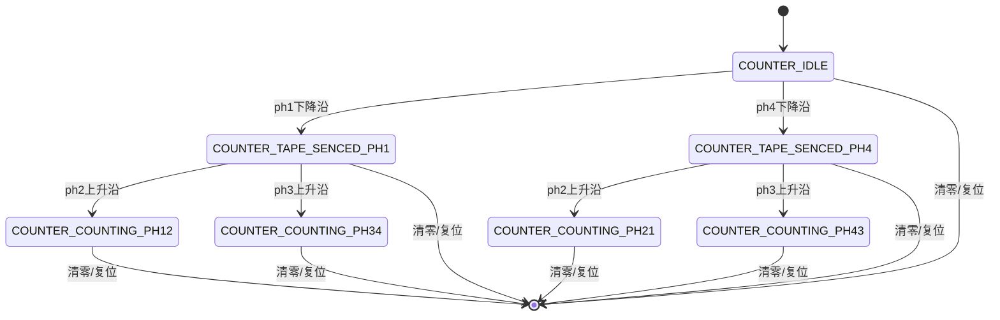

---
tags:
  - tiny-SMD-counter
  - 嵌入式
  - 正交编码器
---

# 四向计数的四种情况

## 从PH1侧进入

### 孔在ph1/ph2侧



<details>
<summary>源代码</summary>

```json
{
    "signal": [
        {"name": "ph1", "wave": "hlhlhlhlh|lhlhlh....."},
        {"name": "ph2", "wave": "h...lhlhl|hlhlhlhlh..", "phase":0.5},
        {"name": "ph3", "wave": "h...l....|........h..", "phase":0.5},
        {"name": "ph4", "wave": "h.....l..|..........h"},
    ]
}
```

</details>

### 孔在ph3/ph4侧


<details>
<summary>源代码</summary>

```json
{
    "signal": [
        {"name": "ph1", "wave": "hl.......|.....h....."},
        {"name": "ph2", "wave": "h...l....|........h..", "phase":0.5},
        {"name": "ph3", "wave": "h...lhlhl|hlhlhlhlh..", "phase":0.5},
        {"name": "ph4", "wave": "h.....lhl|hlhlhlhlhlh"},
    ]
}
```

</details>

## 从PH4侧进入
实际上就是把ph1的波形和ph4交换，把ph2和ph3交换

### 孔在ph1/ph2侧


<details>
<summary>源代码</summary>

```json
{
    "signal": [
        {"name": "ph1", "wave": "h.....lhl|hlhlhlhlhlh"},
        {"name": "ph2", "wave": "h...lhlhl|hlhlhlhlh..", "phase":0.5},
        {"name": "ph3", "wave": "h...l....|........h..", "phase":0.5},
        {"name": "ph4", "wave": "hl.......|.....h....."},
    ]
}
```

</details>

### 孔在ph3/ph4侧



<details>
<summary>源代码</summary>

```json
{
    "signal": [
        {"name": "ph1", "wave": "h.....l..|..........h"},
        {"name": "ph2", "wave": "h...l....|........h..", "phase":0.5},
        {"name": "ph3", "wave": "h...lhlhl|hlhlhlhlh..", "phase":0.5},
        {"name": "ph4", "wave": "hlhlhlhlh|lhlhlh....."},
    ]
}
```

</details>

## 代码思路

这样看来就很明显了，但是今天我准备先去洗澡，所以明天回来再写吧。

## 代码思路（第二天版）

好，时间转眼来到第二天。我们来梳理一下代码思路。

我们有一个状态机，有如下状态：
```c
enum {
    COUNTER_IDLE,
    COUNTER_TAPE_SENCED_PH1,
    COUNTER_TAPE_SENCED_PH4,
    COUNTER_COUNTING_PH12,
    COUNTER_COUNTING_PH21,
    COUNTER_COUNTING_PH34,
    COUNTER_COUNTING_PH43,
} states;
```

在任何状态，当清零键被按下（或者系统复位时）状态重置为`COUNTER_IDLE`。

当处于`COUNTER_IDLE`状态时：
- 此时屏幕显示`0000`
- 两组光电对管都被启用
- 两组定时器被禁用
- ph1的下降沿将使状态变为`COUNTER_TAPE_SENCED_PH1`
- ph4的下降沿将使状态变为`COUNTER_TAPE_SENCED_PH1`

当处于`COUNTER_TAPE_SENCED_PH1`状态时：
- 此时屏幕显示`0001`
- 两组光电对管都被启用
- 两组定时器被启用
- ph2的上升沿将使状态变为`COUNTER_COUNTING_PH12`
- ph3的上升沿将使状态变为`COUNTER_COUNTING_PH34`

当处于`COUNTER_TAPE_SENCED_PH4`状态时：
- 此时屏幕显示`0001`
- 两组光电对管都被启用
- 两组定时器被启用
- ph2的上升沿将使状态变为`COUNTER_COUNTING_PH21`
- ph3的上升沿将使状态变为`COUNTER_COUNTING_PH43`

当处于`COUNTER_COUNTING_PHxx`状态时：
- 屏幕显示随其中一个定时器的计数变化更新
- 另一个定时器被禁用
- 当在ph1/2计数时，ph3/4的光电对管被关闭以节省能耗，反之亦然。

实际上，检测ph2、ph3上升沿的应该是tim外设的cc中断，这样可以少写两个irq handler。

让deepseek帮我画了个导图，不过好像在vscode的预览里看不了。  
不过github的预览应该支持，所以还是放在这里吧。

