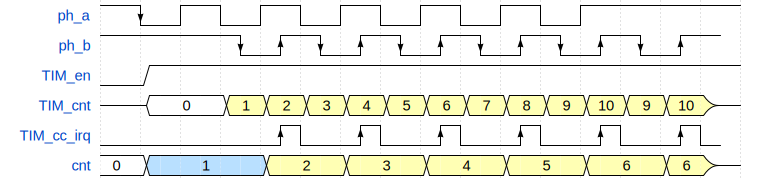

# 定时器时序的具体分析

## a0.1时序分析
在a0.1的固件中，我们通过多次尝试，实现了一个可用的双向计数：
```c
void EXTI6_IRQHandler() {
    // ph_b
    ...
    TIM_EncoderInterfaceConfig(
        TIM1, 
        TIM_EncoderMode_TI1, 
        TIM_ICPolarity_Rising,
        TIM_ICPolarity_Rising
    );

    TIM_ITConfig(TIM1, TIM_IT_CC1, DISABLE);
    TIM_ITConfig(TIM1, TIM_IT_CC2, ENABLE);
    ...
}

void EXTI7_IRQHandler() {
    // ph_a
    ...
    TIM_EncoderInterfaceConfig(
        TIM1, 
        TIM_EncoderMode_TI2, 
        TIM_ICPolarity_Rising,
        TIM_ICPolarity_Falling
    );

    TIM_ITConfig(TIM1, TIM_IT_CC1, ENABLE);
    TIM_ITConfig(TIM1, TIM_IT_CC2, DISABLE);
    ...
}
```
在硬件连接上，PC7（PH_A）连接到了TIM1的CH2，而PC6（PH_B）连接到了TIM2的CH1

所以我们总结了这样的规律

|从哪里插入|计数模式 EncoderMode|启用中断的CC通道|极性翻转 ICPolarity|
|-|-|-|-|
|PH_A|TI2（PH_A）|CC1（PH_B）|IC1（PH_B）不反相（rising），IC2（PH_A）反相（falling）|
|PH_B|TI1（PH_B）|CC2（PH_A）|IC1（PH_B）不反相（rising），IC2（PH_A）不反相（rising）|

以下是从ph_a侧插入时的时序图。  

<details>
<summary>源代码</summary>

```json
{
    "signal": [
        {"name": "ph_a",       "wave": "hLhlhlhlhlhlh..."},
        {"name": "ph_b",       "wave": "h...LHLHLHLHLHLH", "phase": 0.5},
        {"name": "TIM_en",     "wave": "01..............", "data": "TIM_enabled"},
        {"name": "TIM_cnt",    "wave": "z2.333333333333z", "data": "0 1 2 3 4 5 6 7 8 9 10 9 10"},
        {"name": "TIM_cc_irq", "wave": "l....PlPlPlPlPlP", "phase": 0.5},
        {"name": "cnt", "wave": "2..5.....3...3...3...3...3...3.z.", "data": "0 1 2 3 4 5 6 6", "period": 0.5, "phase": 0.5}
    ]
}
```
</details>

可以看见，在第一个ph_a下降沿之后，TIM被启用，cnt被设为1。之后TIM在每次ph_b上升下降沿时，采样ph_a的电平，以此决定TIM_cnt增减。每一次ph_b上升沿产生CC1中断，将TIM_cnt计算之后更新给cnt。

## a0.2时序分析

以下是a0.2四向计数的标准时序，未来实现出来的结果应该完全符合这个时序。
（是的，时至今日a0.2固件主要功能依然没有完全实现）

### 从1a侧插入，孔在ph1


<details>
<summary>源代码</summary>

```json
{
    "signal": [
        ["input",
        {"name": "ph1_a",  "wave": "hLhlhlhlhlhlh....."},
        {"name": "ph1_b",  "wave": "h...LHLHLHLHLHLH..", "phase": 0.5},
        {"name": "ph2_a",  "wave": "h...l..........h..", "phase": 0.5},
        {"name": "ph2_b",  "wave": "h.....l..........h"},  
        ],
        ["ph1_TIM",
        {"name": "en",     "wave": "01................"},
        {"name": "cnt",    "wave": "z2.333333333333z..", "data": "0 1 2 3 4 5 6 7 8 9 10 9 10"},
        {"name": "cc_irq", "wave": "l....PlPlPlPlPlPl.", "phase": 0.5},
        ],
        ["ph2_TIM",
        {"name": "en",     "wave": "0.1......0.", "data": "ph_2_TIM_en", "period": 0.5},
        {"name": "cnt",    "wave": "z.2......z.", "data": "0", "period": 0.5},
        {"name": "cc_irq", "wave": "l..........", "period": 0.5},
        ],
        {"name": "cnt", "wave": "2.5.....3...3...3...3...3...3.z.....", "data": "0 1 2 3 4 5 6 6", "period": 0.5}
    ]
}
```
</details>

### 从1a侧插入，孔在ph2


<details>
<summary>源代码</summary>

```json
{
      "signal": [
        ["intput",
        {"name": "ph1_a",  "wave": "hL..........h....."},
        {"name": "ph1_b",  "wave": "h...L..........h..", "phase": 0.5},
        {"name": "ph2_a",  "wave": "h...lhlhlhlhlhlh..", "phase": 0.5},
        {"name": "ph2_b",  "wave": "h.....LHLHLHLHLHLH"},
        ],
        ["ph1_TIM",
        {"name": "en",     "wave": "01.....0"},
        {"name": "cnt",    "wave": "z2.3...z", "data": "0 1"},
        {"name": "cc_irq", "wave": "l......."},
        ],
        ["ph2_TIM",
        {"name": "en",     "wave": "01................",  "data": "ph_2_TIM_en"},
        {"name": "cnt",    "wave": "z.2........4.4.4.4.4.4.4.4.4.4.4.4.z", "data": "0 1 2 3 4 5 6 7 8 9 10 9 10", "period": 0.5},
        {"name": "cc_irq", "wave": "l......PlPlPlPlPlP"},
        ],
        {"name": "cnt", "wave": "2.5..........4...4...4...4...4...4.z", "data": "0 1 2 3 4 5 6 6", "period": 0.5}
    ]
}
```
</details>

### 其余的情况

和前面两种差得不多。我不想再画波形图了😭。

## ~~后续~~
~~显然些时序图是有问题的。~~  
~~上面绘制的a0.1版本时序图，和现实无法对应。按照图里的逻辑，计数器是无法正常工作的，而现实里却能很稳定地工作。~~  
~~于是依照a0.1时序图所画的a0.2时序图也有问题。~~  
~~我放弃思考了。~~  


## 后续2
我花了好几个小时试图弄清楚为什么，终于给我研究出来了

我一直以为TIM_EncoderMode_TI1是“在TI1的上升下降沿计数”。然而实际的定义是这样的：

- `TIM_EncoderMode_TI1`: 在TI2的上升下降沿检测TI1的电平
- `TIM_EncoderMode_TI2`: 在TI1的上升下降沿检测TI2的电平
- `TIM_EncoderMode_TI12`: 在两者上升下降沿检测对方的电平

实际上库里有注释，但是我没看。我真tm活该啊。

现在，上面时序图的错误已经修正了。

