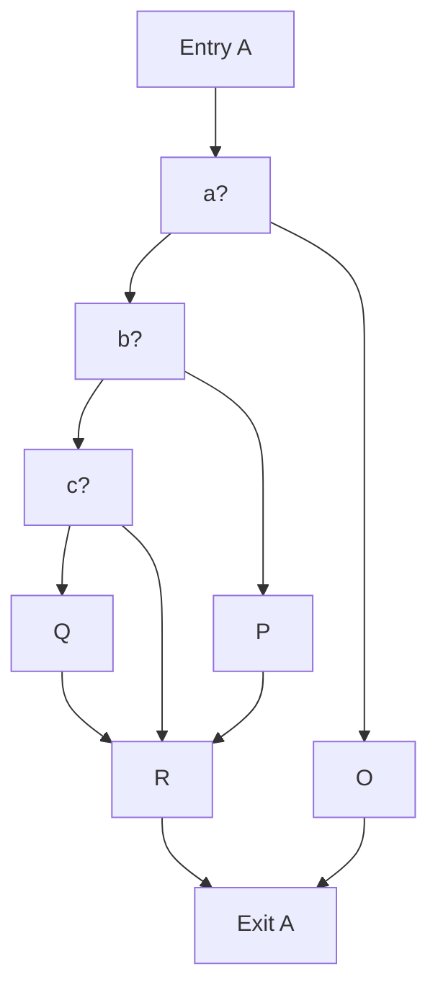
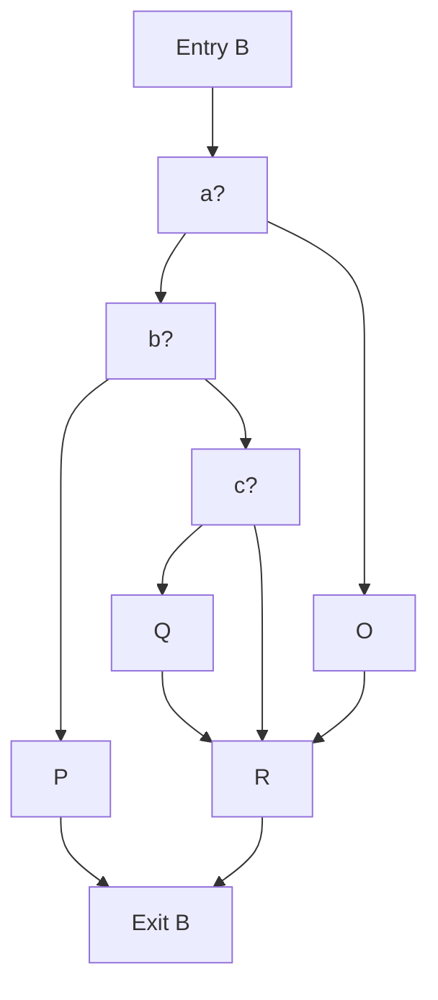

# 优化continue

上集说到，我们发现continue的作用是跳转到循环块的末尾。  
所以可以通过移动分支，将continue和末尾合并，从而消除从continue。  
今天我们从算法的角度看一看

## 算法：检测某段代码是否可以通过移动分支消除continue

观察这个两个例子，两者的continue被放在了不同的分支里。

<table>
<thead>
    <tr>
        <th>例A（可以通过移动分支优化）</th>
        <th>例B（不可通过移动分支优化）</th>
    </tr>
</thead>
<tbody>

<tr><td>

```py
# Entry A
if a:
    # do O
    continue
elif b:
    # do P
elif c:
    # do Q
# do R
# Exit A
```

</td>
<td>

```py
# Entry B
if a:
    # do O
elif b:
    # do P
    continue
elif c:
    # do Q
# do R
# Exit B
```

</td>
</tr>

<tr><td>



</td>
<td>



</td>
</tr>

</tbody>
</table>

咋一看两者的流程图似乎长得没有什么独特之处，但是真的是这样吗？

注意到：
分支必然会汇聚，最终汇聚于Exit。对于每一个分支节点，**各个分支的汇聚路径相互独立，没有重合部分**，
则该分支节点及其子节点可以使用纯if-else树表示（即可以通过移动分支，消除continue）。
反之则不行（需要添加额外的辅助变量）。

结合例A来看：

- 对c进行分析
    - c --> Q --> R
    - c --> R
- 对b进行分析
    - b --> c --> R
    - b --> P --> R
- 对a进行分析
    - a --> b --> R --> Exit
    - a --> O --> Exit

每一个节点的每一条汇聚路径都相互独立，所以这个流程图可以用纯if-else树表示

再看例B:

- 对c进行分析
    - c --> Q --> R
    - c --> R
- 对b进行分析
    - b --> c --> **R --> Exit**
    - b --> P --> Exit
- 对a进行分析
    - a --> b --> Exit
    - a --> O --> **R --> Exit**

可以看到，a的一个分支经过b，从而经过了`R --> Exit`，而a的另一个分支也经过了`R --> Exit`。两条路径重合了。所以这个流程图可以不能用纯if-else树表示

听起来像依然缺乏说服力，对吗？看来准确的证明更能说服人一些。  
~~可惜这里空间太小~~
<details markdown="1">

<summary>
证明过程（由d老师赞助播出）：
</summary>

**Prompt:**

<blockquote  markdown="1">

有办法证明下面这个定理吗

一个无循环的流程图（DAG）可以等价变换为纯二元判断树（无跳转），且不引入新判断节点，
当且仅当：
对图中每个判断节点，它的两个分支所到达的节点集合（除了最终的汇聚点）互不相交。

换句话说，控制流图必须是嵌套的，不允许有交叉边（不同判断分支之间的汇合必须在严格的下一个层级）。

</blockquote>

**d老师:**

<blockquote  markdown="1">

好的，我们先明确一下你的问题，然后一步步推理并尝试证明。

---

## 1. 问题重述

我们有一个 **有向无环图（DAG）** 控制流图，其中：

- 节点分为普通节点（执行语句）和判断节点（if 条件）。
- 判断节点有两个出边（true / false 分支）。
- 图是 DAG，没有循环。
- 最终有一个**唯一的汇聚点（exit）**（多个路径最终都到达同一个出口节点）。

我们想把它等价变换为一个 **纯二元判断树（无跳转）**，并且 **不引入新的判断节点**。

**定理**：  
这种变换是可能的 **当且仅当**  
对图中每个判断节点，它的两个分支所到达的节点集合（除了最终的汇聚点）互不相交。

换句话说，不同分支在遇到下一个判断节点之前，不能汇合（除了最终的汇聚点）。

---

## 2. 理解条件

设判断节点 $P$ 的两个分支分别到达的节点集合为 $S_T$ 和 $S_F$，汇聚点（exit）记为 $E$。

条件说：  
$$
(S_T \setminus \{E\}) \cap (S_F \setminus \{E\}) = \varnothing
$$
即除了最终汇聚点 $E$ 外，两个分支路径上不会遇到相同的节点。

这实际上意味着：一旦从 $P$ 的两个分支分开，它们不会在到达 **下一个判断节点** 之前汇合到同一个非出口节点。  
如果汇合，则汇合点必须在出口 $E$，或者汇合后立即到出口。

---

## 3. 必要性证明（⇒）

假设我们可以把 DAG 变换成纯二元判断树（无跳转的树形结构）。

在二元判断树中，每个判断节点有两个分支，这两个分支的子树是 **完全不相交** 的节点集合（除了它们最终都结束于隐含的出口，但出口在树中可能是不同叶子，但在 CFG 中出口是唯一节点，所以树叶子都映射到同一个 E，但路径上节点不共享）。

因此，在树中，从判断节点 $P$ 出发的两个分支，在到达出口之前，不会共享任何节点（因为树没有交叉路径）。

当我们把树映射回原始 DAG 时，这个性质必须保持：两个分支的节点集合（除了 E）不相交。

所以，条件是必要的。

---

## 4. 充分性证明（⇐）

假设原 DAG 满足：对每个判断节点，两个分支的节点集合（除了 E）互不相交。

我们要构造一个等价的二元判断树，不引入新判断。

---

### 4.1 思路

从入口节点开始，按拓扑顺序处理判断节点。

因为 DAG 无环，我们可以用递归方式（或迭代方式）把图“展开”成树：

- 从入口节点开始模拟执行。
- 当遇到判断节点 $P$ 时，它的两个分支分别导向两个不相交的子图 $G_T$ 和 $G_F$（除了 E）。
- 因此我们可以分别将 $G_T$ 和 $G_F$ 递归地展开成子树，并且它们不会有重叠的判断节点需要重复生成（因为节点不相交，除了 E）。
- 出口 E 在树中表现为叶子。

---

### 4.2 关键点

如果两个分支在某个非 E 节点汇合，那么该汇合点必须在两个分支的公共部分，这与条件矛盾。  
所以汇合只允许在 E。

因此，每个判断节点之后，两边的路径是完全独立的，直到结束（E）。  
这样我们可以安全地复制 E（在树中多个叶子指向同一个语义出口），而不会导致节点重复出现在两个分支路径上（除了 E）。

---

### 4.3 构造算法

1. 从入口节点 $v_0$ 开始。
2. 如果当前节点是普通节点，生成一个顺序节点，并转到它的唯一后继（在 DAG 中）。
3. 如果当前节点是判断节点 $P$：
   - 根据条件，true 分支到达的节点集合 $S_T$ 和 false 分支的 $S_F$ 除了 E 不相交。
   - 分别以 $P.\text{true}$ 和 $P.\text{false}$ 为起点，递归生成左右子树。
   - 因为不相交，递归过程中不会遇到同一个判断节点被两个分支同时处理（除了 E 作为递归基）。
4. 如果当前节点是 E，生成叶子（退出）。

这样生成的树与原 DAG 执行顺序等价，且没有引入新判断节点。

---

## 5. 结论

我们证明了：

- 如果 DAG 能转为无跳转的二元判断树 ⇒ 条件成立（必要性）。
- 如果条件成立 ⇒ 我们可以构造这样的树（充分性）。

因此定理得证。

</blockquote>

</details>
