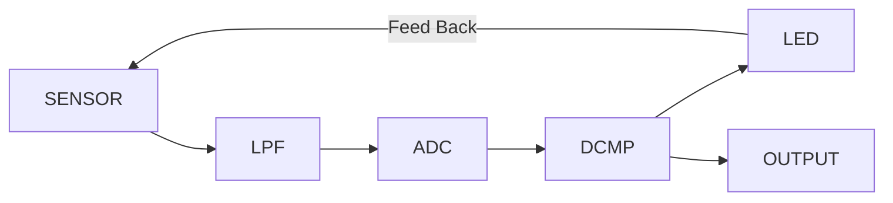

---
tags:
  - 嵌入式
  - PWM
  - Delta-Sigma调制
---

# 光透过率计-原理篇-其二

[上回说到](../../posts/20251028/index.md)，我们讨论了各种测量透过率的方案，最后讨论出使用PWM+闭环反馈来线性地测定样品的透光率。但是PWM方案不够好，我有更好的方案。上一期没写完，这期补充说明一下。

出于任务压力，我没办法像上期一样使用哈基米叙事。“把文案变得有趣”这样的工作，还是暂时留到未来吧。

## PWM调制的缺陷

当你使用PWM产生指定占空比的光时，似乎一切都在你的掌握之中，但是果真如此吗？

你想要读出16bit的透光度，那么你的PWM就至少要有16bit。假设你的载波频率是100kHz。那么你就需要给你的TIM外设输入6.5 GHz的时钟。这要是能做出来，65%人类感谢你。所以你必然降低载波频率。比如你用某不太知名南京厂商的144MHz主频的单片机，那么在16bit下你只能输出2.2kHz。

那你说：好，我不介意频率低，频率低就低嘛，反正接收端还要加个低通嘞。但是就算把载波频率降到只有2kHz，pwm依然有一些无法解决的问题。

在极低或者极高占空比情况下，比如说你要输出1/65536占空比的脉冲，这也就意味着，led每次只点亮1/144MHz = 6.9ns。专业的用于可见光通信的LED可能勉强达到这个速度，可是你让我用几分钱甚至几厘钱成本的LED跑到144MHz？要是真能做到，那恐怕1000%人类都要感谢你。

那再苦一苦载波频率，再降一降？让led最小的闪烁周期达到1μs，这样LED就不至于来不及响应了？好，2kHz除以144，最后你的载波频率变成了13.9Hz，比电竞帧率稍微高一点点，倒是可喜可贺。那接收端设计滤波器的朋友就要红温了：谁来给你设计截止频率只有几赫兹甚至零点几赫兹的滤波器啊？那延迟不得爆表？闭环还做不做了？

综上，用PWM无法实现高精度（高比特数）且占空比趋于极端值的闭环控制。我们需要改换思路。

## Delta-Sigma调制

终极杀器，终于还是端上台面来了。让我们揭开她的盖头吧。

DSM并不是什么特别复杂的东西，不要被它的名字吓倒了。我们抛开各种繁琐的数学公式，直接来看具体的实现。

首先，adc每周期采样一次光电传感器的模拟输入，将读出的数据给到数字比较器。数字比较器将得到的数值与预先设置好的值作比较，如果输入值大于预定值，则熄灭LED，如果小于预定值，则点亮LED。这样，通过频繁地点亮和熄灭LED，把输出的平均光强控制在指定值。就像下图所绘制的一样：

这样，我们只需要接收数字比较器的输出，然后统计它在一定时间里，输出高电平的时间的占比，于是我们就读出了类似于“PWM占空比”的值。使用之前说过的方法，就可以求得光强比例，即透过率。

DSM可以在保证闪烁周期足够长的情况下，频率依然足够高。并且响应比PWM快得多。

